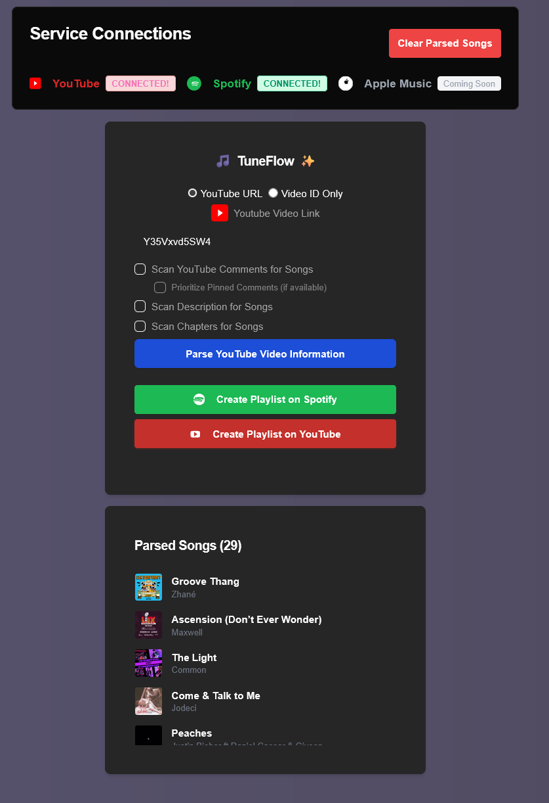
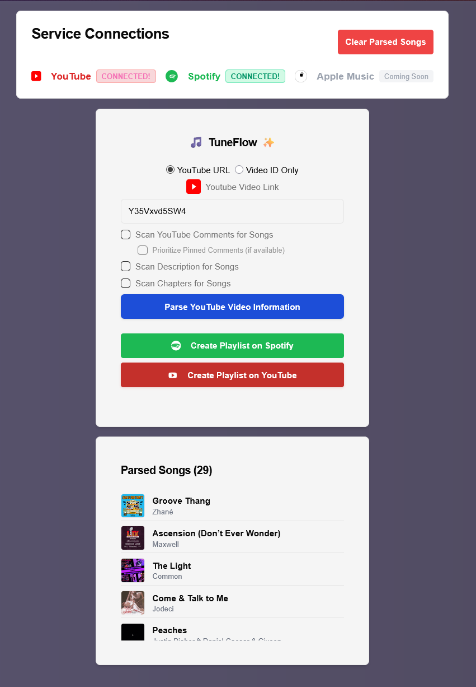

# 🎶 TuneFlow

TuneFlow is an AI-powered playlist generator that seamlessly integrates YouTube and Spotify to help you discover, parse, and organize music from videos and comments into personalized playlists. Built with Next.js, Genkit, and a modern UI, TuneFlow is your all-in-one music companion! 🚀

## App Screenshots 📸✨

Here are screenshots of the TuneFlow app in both dark and light mode—see the magic in action! 🌙☀️

<p align="center">
  
  
</p>

---

## ✨ Features

- 🔍 **Parse YouTube Comments & Descriptions**
  - Extract song titles and artists from YouTube comments, video descriptions, and chapters.
  - Supports both direct video links and manual input.
- 🤖 **AI-Powered Song Recognition**
  - Uses Genkit and Google Gemini AI for advanced song identification and smart recommendations.
- 🎵 **Spotify Playlist Creation**
  - Instantly create Spotify playlists from parsed YouTube content.
  - Add, remove, and manage tracks directly from the app.
- ▶️ **YouTube Playlist Creation**
  - Instantly create regular YouTube playlists (not YouTube Music) from parsed tracks.
  - Authenticate with your Google account and export your playlist with one click.
- 🧠 **Smart Caching & Performance**
  - Uses Redis to cache album art and API responses for fast, efficient browsing.
- 🌙 **Dark Mode & Accessibility**
  - Beautiful, accessible UI with Radix UI and Shadcn/ui, plus dark mode support and Dark Reader compatibility.
- 🔑 **Secure Authentication**
  - OAuth-based Spotify login; API keys and tokens are securely managed.
- 🛠️ **Developer-Friendly**
  - Well-documented codebase with JSDoc comments, clear sectioning, and easy onboarding for contributors.

---

## 🚧 Future Implementations

Here are some ideas and plans for expanding TuneFlow in the future:

| Feature                        | Status        | Notes                                                                                       |
|------------------------------- |--------------|--------------------------------------------------------------------------------------------|
| ▶️ YouTube Playlist Creation   | ✅ Done       | Create regular YouTube playlists directly from parsed tracks. (YouTube Music not supported.) **Note: I need to get the app approved for public use on Google OAuth.** |
| 🌗 Day/Night Toggle             | ✅ Done       | Implement a seamless toggle between light and dark modes, allowing users to switch themes for optimal comfort and accessibility at any time. |
| 📱 Optimize for Mobile Layouts | 🚧 In Progress | Enhance TuneFlow's UI and user experience for mobile devices. This includes responsive layouts, touch-friendly controls, and streamlined navigation—so you can create and manage playlists seamlessly on any screen, anywhere! |
| 🍏 Apple Music API             | 🕒 Planned    | Explore adding Apple Music integration for broader playlist export options.                 |
| 🧠 Advanced Song Detection     | 🕒 Planned    | Detect songs in videos even without tracklists in description/comments using AI/audio.      |
| 🎼 YT Music Connection         | 🕒 Planned    | Explore connecting to YouTube Music for playlist creation if supported by YouTube.          |
| 🎧 SoundCloud API Integration  | ⏸️ Paused     | Backend implemented, but feature is paused until API keys/support resume after May 2.       |

Have more ideas? Feel free to open an issue or submit a pull request!

---

## 🛠️ Tech Stack

- [Next.js](https://nextjs.org/) – React framework for building web applications
- [Genkit](https://genkit.dev/) – AI development platform
- [Google Gemini](https://deepmind.google/technologies/gemini/) – Multimodal AI model
- [Radix UI](https://www.radix-ui.com/) & [Shadcn/ui](https://ui.shadcn.com/) – Accessible, customizable UI components
- [Spotify API](https://developer.spotify.com/documentation/) – Music catalog and playlist management
- [YouTube API](https://developers.google.com/youtube/v3) – Video and comment data extraction
- [Redis](https://redis.io/) – Fast caching and data storage

---

## 📦 Dependencies

- `next`, `react`, `react-dom`
- `@genkit-ai/core`, `@genkit-ai/googleai`, `@genkit-ai/next`
- `@radix-ui/react-*`, `shadcn/ui`
- `class-variance-authority`, `clsx`, `lucide-react`, `tailwind-merge`, `tailwindcss-animate`
- `ioredis`, `googleapis`, `youtube-chapters-finder`

---

## 🚀 Getting Started

1. **Clone the repository:**

   ```bash
   git clone https://github.com/<your-username>/TuneFlow.git
   cd TuneFlow
   ```

2. **Install dependencies:**

   ```bash
   npm install
   # or
   yarn install
   ```

3. **Set up environment variables:**
   - Create a `.env.local` file based on `.env.example`.
   - Required variables:
     - `SPOTIFY_CLIENT_ID`, `SPOTIFY_CLIENT_SECRET`, `SPOTIFY_REDIRECT_URI`
     - `YOUTUBE_API_KEY`
     - `GOOGLE_GENAI_API_KEY`
     - `REDIS_URL` (optional, defaults to local Redis)
4. **Run the development server:**

   ```bash
   npm run dev
   # or
   yarn dev
   ```

5. **Open [http://localhost:3000](http://localhost:3000) and start creating playlists!**

---

## 📝 Contributing

Contributions are welcome! Please open issues or submit pull requests for new features, improvements, or bug fixes. Be sure to follow the code style and documentation conventions for consistency.

---

## 📝 Legal Documents

This project displays its Privacy Policy and Terms of Use as styled pages.

If you clone this repo, you must provide `public/PRIVACY_POLICY.md` and `public/TERMS_OF_USE.md` for these pages to work. You can edit these markdown files to match your own requirements.

- Privacy Policy: `/privacy-policy`
- Terms of Use: `/terms-of-use`

---

## 🛡️ License

MIT License. See [LICENSE](LICENSE) for details.

---

## 🙏 Acknowledgements

- Inspired by the power of open music and AI.
- Built with ❤️ by the TuneFlow community.

---
